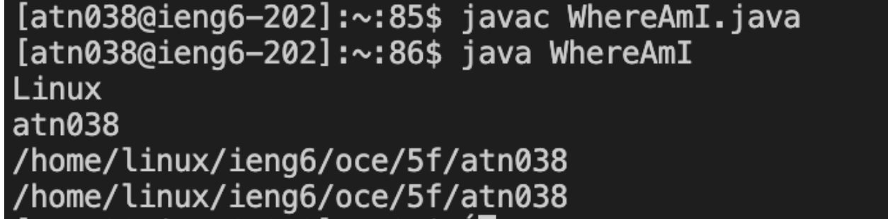

# Lab Report 1

## Step 1: Installing Vscode
First, you must download [VSCode](https://code.visualstudio.com/) on your computer. After the installation is complete, open up VSCode. An application window will pop up and your screen should look something like this. 

## Step 2: Remotely Connecting

First, you want to open a terminal in VSCode. Then you want to use the ssh command.

 ```
 ssh <course-specific account/UCSD Username>@ieng6.ucsd.edu
```

 If this is the first time you're connecting to the server, it will prompt you with a message asking for you want to continue connecting. Type yes in the terminal to continue. Then it will have you type in the password for your account. Once you sucessfully type in the password, you should get an output like this in the terminal.


## Step 3: Trying Some Commands

Try using commands like cd, ls, pwd to view and access different directories.

Here are more specific commands to try.

- cd ~
- cp /home/linux/ieng6/cs15lfa22/public/hello.txt ~/
- cat /home/linux/ieng6/cs15lfa22/public/hello.txt

Here is what printing all the directories of the working directory looks like. 


To logout of the remote server, you can use the Ctrl-D shortcut or type exit in the terminal.

## Step 4 Moving Files with scp

In this step, we will learn how to copy files from your computer to a remote computer. First you will need to create a file to copy.In this example, we will create a file called WhereAmI.java with the following contents in it.
```
class WhereAmI {
  public static void main(String[] args) {
    System.out.println(System.getProperty("os.name"));
    System.out.println(System.getProperty("user.name"));
    System.out.println(System.getProperty("user.home"));
    System.out.println(System.getProperty("user.dir"));
  }
}
```
After creating the file, type the command in the terminal:

```
scp WhereAmI.java <Your Username>@ieng6.ucsd.edu:~/
```
You should then be prompted to enter the password for the account.

Then, connect to the remote server again by using the command ssh as instructed in Step 2.
Once connected to the server run these javac and java commands.
```
javac WhereAmI.java
java WhereAmI
```
The following should then be printed in the terminal.


## Step 5 Setting an SSH Key

First you want to type the command ssh-keygen in the terminal. You should then be given the prompt:
```
Enter file in which to save the key (/Users/(Your Name/.ssh/id_rsa):
```
Press enter again to specify the default path.
Enter this command on the client side.
```
ssh (Your Username)@ieng6.ucsd.edu)
```
Once you enter the password and connected to the server, type this to the terminal.
```
mkdir .ssh
```
After typing this command, logout of the server. Once you're back on the client, type this command.
```
$ scp /Users/<Your Name>/.ssh/id_rsa.pub <Username>@ieng6.ucsd.edu:~/.ssh/authorized_keys
```
After completing these steps, you should be able to use the commands ssh and scp without needing to enter your password.

Here is what it looks like when you login without a password.


## Step 6 Optimizing Remote Running

Edit the WhereAmI.Java. Then copy the file the server in the most optimal way (fewest keystrokes).

Here is an example of copying the edited file to the server and running the file in one command line.

