# Lab Report 2

## Part 1

Here is the code for my Simple Search Engine

```
import java.io.IOException;
import java.net.URI;
import java.util.ArrayList;

class Handler implements URLHandler {
    // The one bit of state on the server: a number that will be manipulated by
    // various requests.
    int num = 0;
    ArrayList<String> list = new ArrayList<>();

    
    public String handleRequest(URI url) {

        if (url.getPath().equals("/")) {
            return String.format("Welcome to the Search Engine!");
            }else if (url.getPath().contains("/search")){
                String [] searchResult = url.getQuery().split("=");
                if (searchResult[0].equals("s")) {
                    String newString = "";
                    for(int i = 0; i < list.size(); i ++){

                        if(list.get(i).contains(searchResult[1])){
                            newString+=(list.get(i)+ " ");
                        }
                    }
                    return newString;
                    

               
                }
                return String.format(list.get(0));
            
            
        } else {
            System.out.println("Path: " + url.getPath());
            
            if (url.getPath().contains("/add")) {
                String[] parameters = url.getQuery().split("=");
                if (parameters[0].equals("s")) {
                    list.add(parameters[1]);
                    return String.format(parameters[1] + " added to the Search. The Search now has %d results!", list.size());
                }
            }
        
            return "404 Not Found!";
        }
    }
}


class SearchEngine {
    public static void main(String[] args) throws IOException {
        if(args.length == 0){
            System.out.println("Missing port number! Try any number between 1024 to 49151");
            return;
        }

        int port = Integer.parseInt(args[0]);

        Server.start(port, new Handler());
    }
}
```

Here is what the webpage looks like when we I first start up my server.

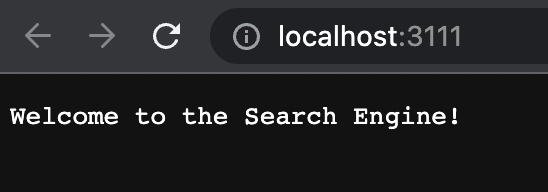
In this screenshot, the SearchEngine's main method is called that takes in a string argument. It then parses the string into an int variable called port. The port variable is used to run the server.

Here is what the webpage looks like when I add a query to the Search Engine.

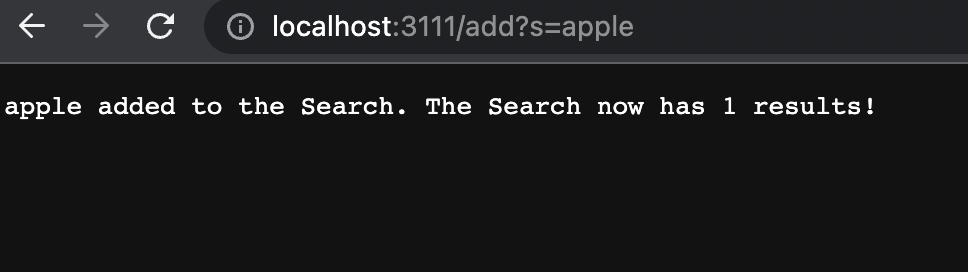
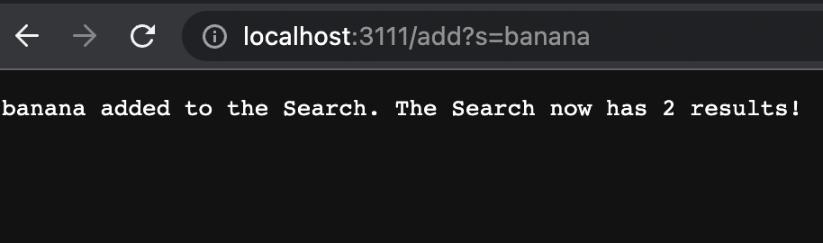
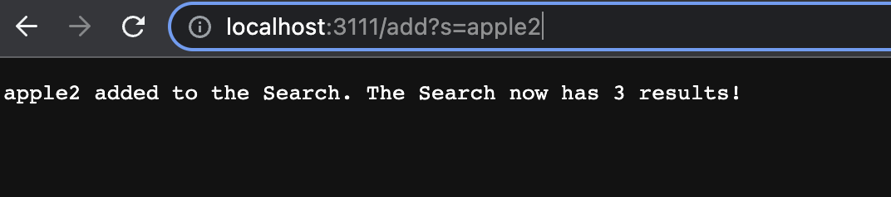
For these screenshots, the handlerequest method in the Handler class is called which takes in a URL as an argument. If the URL contains the path "/add", then the method uses the URL and splits the query into two elements in a string array called parameters. Anything before the equal sign in the query is placed in the zero index of the array and anything after the equal sign in the query is placed in the first index of the array which should be the query. The query is then added to the a list that contains all the queries that were added.


Here is what the webpage looks like when I search for the query "app".

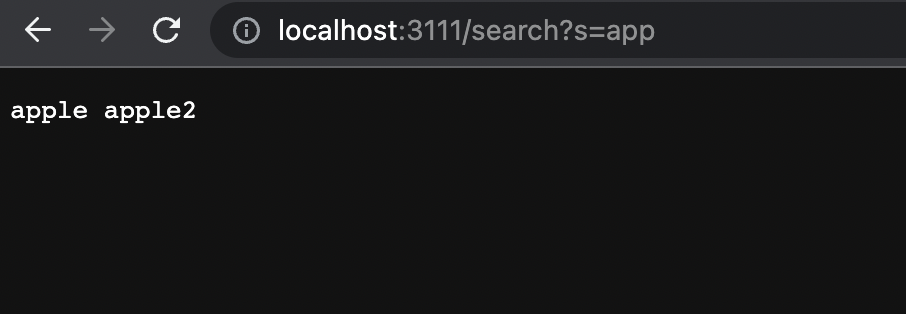
In this screenshot, the handlerequest method in the Handler Class is again called which takes in a URL as an argument. If the URL contains the path "/search", then the method splits the contents of the query into two elements in a string array called seardcResult. Anything before the equal sign in the query is placed in the zero index of the array and anything after the equal sign in the query is placed in the first index of the array which should be the search result. If an element in the list of queries contains the search result, then that element is appended on a string variable called newString.

## Part 2

### First bug
Testing the Reversed in the Array methods.

Failure-inducing Input
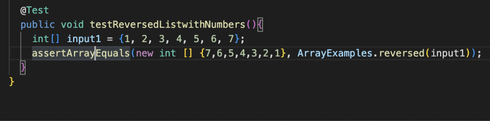
Symptoms
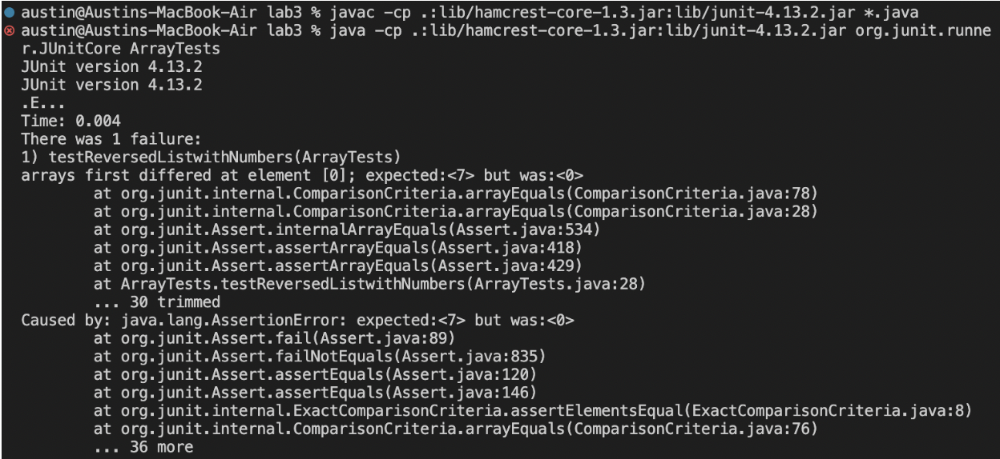
Fixed Code
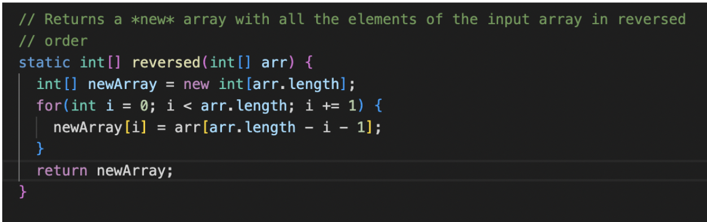
The bug causes that symptom no matter the input because the method never returns the new array, and it uses the new array that is populated with elements 0 to change the elements in the actual array.

### Second Bug
Testing the Merge method in the List methods.

Failure-inducing Input
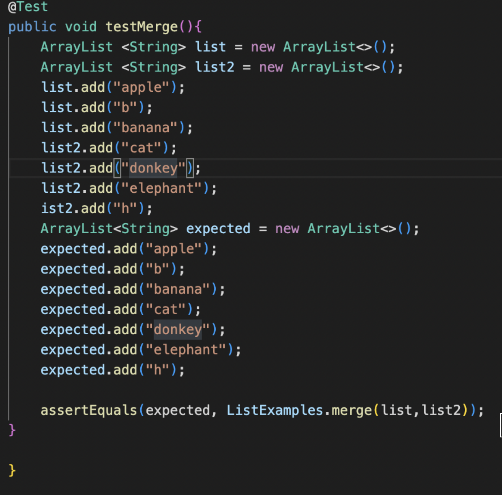
Symptoms
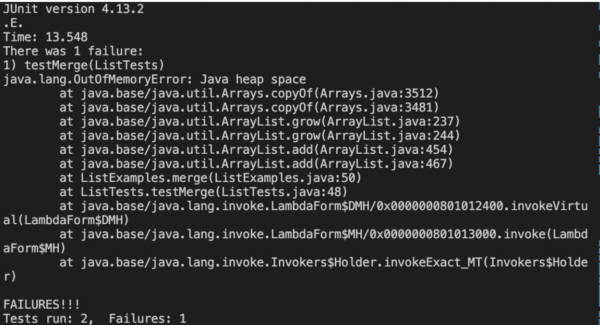
Fixed Code
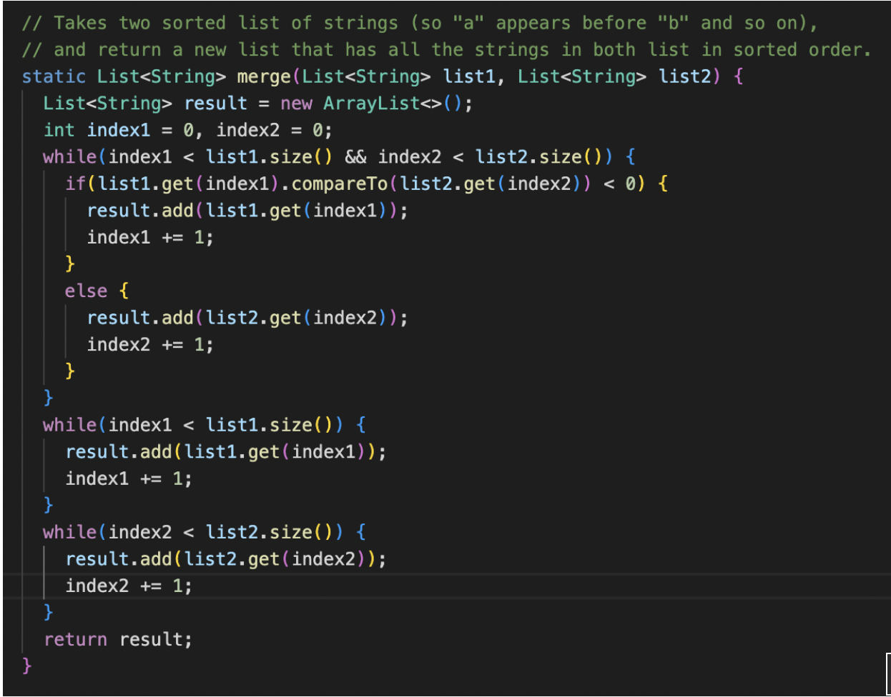
The bug causes that symptom whenever the second list has more elements than the first list because the while loop for the second list never terminates due to the wrong index being incremented.