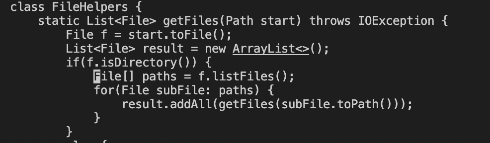
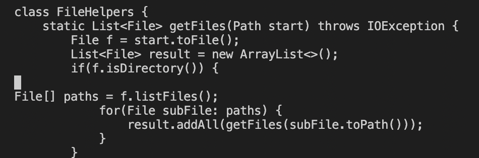
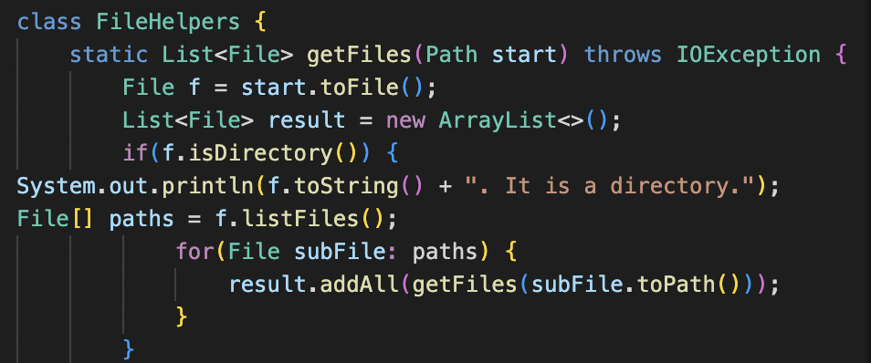

# Lab Report 4

## Part 1

### Task: Adding a new line to print before File[] paths = f.listfiles()
#### Sequence of Commands with Screenshots

```
/File[] <Enter>
```

```
i <Enter> <Escape> k
```

```
i System.out.println(f.toString() + “. It is a directory.”); <Escape> :wq <Enter>
```


## Part 2

First Style: 2 minutes 48 seconds
Second Style: 37 seconds

### Question 1: Which of these two styles would you prefer using if you had to work on a program that you were running remotely, and why?

I would prefer using the second style if I had to work on a program I was running remotely because you avoid needing to scp the file. Furthermore, if you make a mistake you would need to go back on the local computer and fix the code and also scp and ssh again.

### Question 2: What about the project or task might factor into your decision one way or another? (If nothing would affect your decision, say so and why!)

If the file I needed to edit was not on a remote server, then I would prefer editing the file with Virtual Studio Code because I am more comfortable in an IDE than vim. However, if the file was on the remote server then I would prefer using vim because I can avoid using scp and there is more room for error.