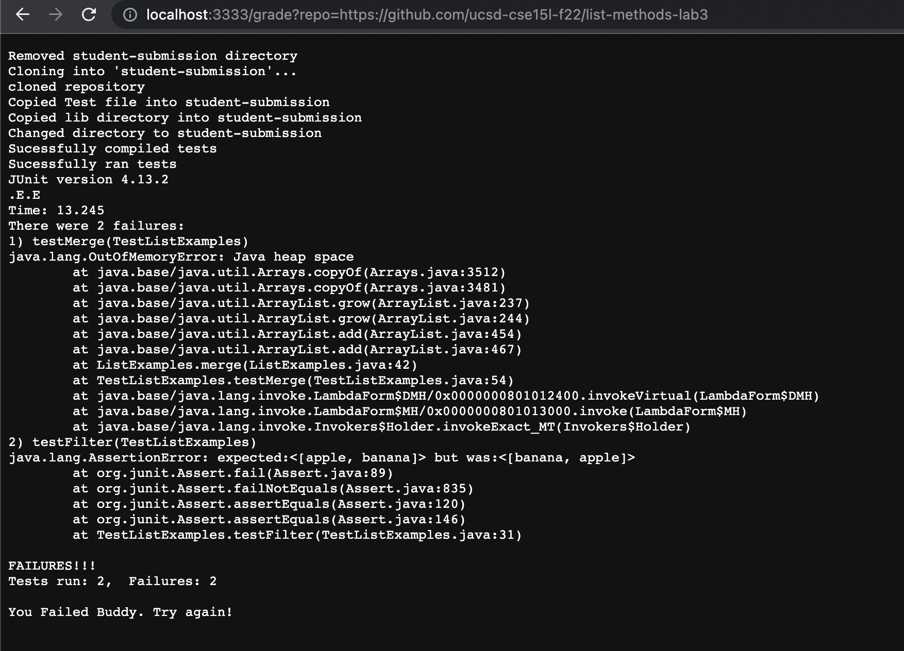
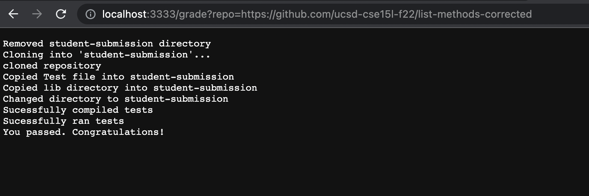
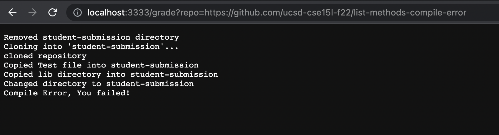

# Lab Report 5

## grade.sh
```
rm -rf student-submission

echo "Removed student-submission directory"
git clone $1 student-submission
echo "cloned repository"

cp TestListExamples.java student-submission


echo "Copied Test file into student-submission"

cp -r lib student-submission
echo "Copied lib directory into student-submission"

cd student-submission
echo "Changed directory to student-submission"

FILE=ListExamples.java
if [ ! -f "$FILE" ];
then
    echo "$FILE was not found"
    exit
fi

javac -cp .:lib/hamcrest-core-1.3.jar:lib/junit-4.13.2.jar *.java 2>errorOutput.txt
if [ -s errorOutput.txt ];
then 
echo "Compile Error, You failed!"
exit
fi

echo "Sucessfully compiled tests"


java -cp .:lib/hamcrest-core-1.3.jar:lib/junit-4.13.2.jar org.junit.runner.JUnitCore TestListExamples > goodOutput.txt

echo "Sucessfully ran tests"


if grep -q "2 tests" "goodOutput.txt" ;
then
echo "You passed. Congratulations!"
exit
fi

cat goodOutput.txt
echo "You Failed Buddy. Try again!"
```

## First Student Submission
### https://github.com/ucsd-cse15l-f22/list-methods-lab3



## Second Student Submission
### https://github.com/ucsd-cse15l-f22/list-methods-corrected



## Third Student Submission
### https://github.com/ucsd-cse15l-f22/list-methods-compile-error



## Trace Script for Third Student Submission

```
rm -rf student-submission
```
There is no standard output and standard error and the return code is zero.

```
echo "Removed student-submission directory"
```
The standard output is "Removed student-submission directory" and there is no standard error. The return code is zero.

```
git clone $1 student-submission
```
The standard output is "Cloning into 'student-submission'..." and there is no standard error. The return code is zero.

```
echo "cloned repository"
```
The standard output is "cloned repository" and there is no standard error. The return code is zero.

```
cp TestListExamples.java student-submission
```
There is no standard output and standard error. The return code is zero.

```
echo "Copied Test file into student-submission"
```
The standard output is "Copied Test file into student-submission" and there is no standard error. The return code is zero.

```
cp -r lib student-submission
```
There is no standard ouput and standard error. The return code is zero.

```
echo "Copied lib directory into student-submission"
```
The standard output is "Copied lib directory into student-submission" and there is no standard error. The return code is zero.

```
cd student-submission
```
There is no standard output and standard error. The return code is zero.

```
echo "Changed directory to student-submission"
```
The standard output is "Changed directory to student-submission" and there is no standard error. The return code is zero.

```
FILE=ListExamples.java
```
There is no standard output and standard error. The return code is zero.

```
if [ ! -f "$FILE" ];
```
The condition evaluates to false because List.Examples.Java exists in the directory.

```
echo "$FILE was not found"
    exit
```
These statements do not run because the if statement above does not evaluate to be true.

```
javac -cp .:lib/hamcrest-core-1.3.jar:lib/junit-4.13.2.jar *.java 2>errorOutput.txt
```
There is no standard output, but the standard error is
```
ListExamples.java:15: error: ';' expected
        result.add(0, s)
                        ^
1 error
```
The return code is nonzero.

```
if [ -s errorOutput.txt ];
```
The conditions evaluates to true because errorOutput.txt is not empty.

```
echo "Compile Error, You failed!"
```
The standard output is "Compile Error, You failed!" and there is no standard error. The return code is zero.

```
exit
```
There is no standard output and standard error. The return code is zero.

```
echo "Sucessfully compiled tests"


java -cp .:lib/hamcrest-core-1.3.jar:lib/junit-4.13.2.jar org.junit.runner.JUnitCore TestListExamples > goodOutput.txt

echo "Sucessfully ran tests"


if grep -q "2 tests" "goodOutput.txt" ;
then
echo "You passed. Congratulations!"
exit
fi

cat goodOutput.txt
echo "You Failed Buddy. Try again!"
```
These lines do not run because they are all after an early exit statement that was executed.